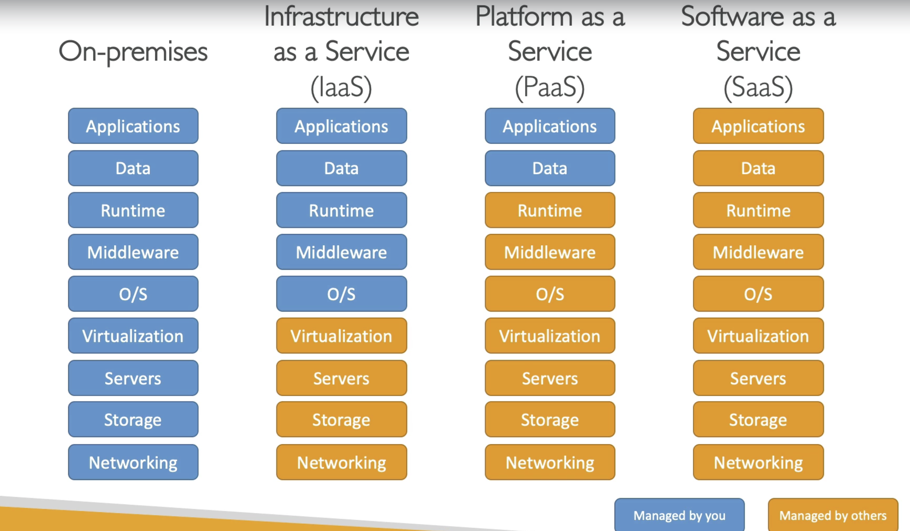

#Cloud computing

- it is like on-demand delivery of IT resources (we just listed in basics)
    - rapid scalable & elasticy
- self-service
- multi-tenancy - multiple customer can use same infra with security & privacy
- pay-as-you-go pricing
- provision exact right type and size of resource
- access to resources - instant

Deployment mode

    private - not exposed to internet
    public - azure,gcp,aws
    hybrid - (some on premise + some on cloud)

Advantages

    pay on demand - no need to buy hardware
    prices - reduced ---> as AWS is large scale
    stop guessing capacity 
    increased speed and agility
    no money needed to maintain data centers
    global infra 

Types of Cloud Computing

###IAAS
  
    provide building blocks for IT
    || to on-premises IT
    flexibility - high

###PAAS
    
    removes need of org. to manage underlying infra
    focus on deployment & manage the your app

###SAAS

    complete product run by these service provider

on-premise vs---- iaas ---------vs --------- paas ---------vs ---------saas
        
             GCP,AWS,azure         Heroku          Google apps,dropbox,zoom 
          

    
Pricing fundamentals 

    compute - compute time
    storage - exact data stored in cloud
    data transfer out of cloud -> paid
    data transfer in -> free
    